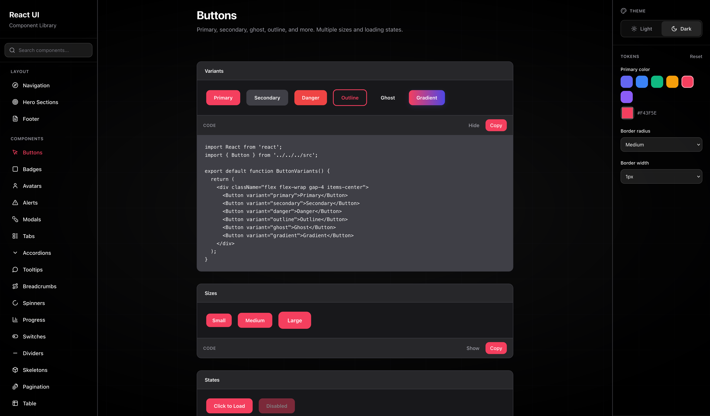

# @cloudvisionapps/react-ui

[](https://www.npmjs.com/package/@cloudvisionapps/react-ui)
[](https://opensource.org/licenses/MIT)

A React component library built with TypeScript and Tailwind CSS. Use it to build consistent UIs across applications with minimal setup.

## Screenshots




## Requirements

- React 18+
- React DOM 18+

## Installation

```bash
npm install @cloudvisionapps/react-ui
```

```bash
yarn add @cloudvisionapps/react-ui
```

```bash
pnpm add @cloudvisionapps/react-ui
```

## Quick Start

Import components and include the library styles in your app (e.g. in your root layout or `main.tsx`):

```tsx
import { Button, Card, Input } from '@cloudvisionapps/react-ui';
import '@cloudvisionapps/react-ui/styles';

function App() {
  return (
    <Card title="Welcome" footer={<Button>Submit</Button>}>
      <Input label="Email" placeholder="Enter your email" />
      <Button variant="primary">Submit</Button>
    </Card>
  );
}
```

## Components

| Component | Description |
|-----------|-------------|
| Accordion | Collapsible content sections |
| Alert | Inline messages and notifications |
| Avatar | User or entity image/initials |
| Badge | Labels and status indicators |
| Breadcrumb | Navigation path |
| Button | Actions with variants and loading state |
| Card | Container with optional title and footer |
| Checkbox | Boolean form control |
| Divider | Visual separator |
| EmptyState | Placeholder when there is no content |
| Footer | Page footer with links and columns |
| Hero | Hero / landing section |
| Input | Text input with label and validation |
| Link | Styled link |
| Modal | Dialog overlay |
| Navigation | Top or side navigation |
| Pagination | Page navigation controls |
| Progress | Progress bar |
| Radio | Single choice from a group |
| Select | Dropdown selection |
| Skeleton | Loading placeholder |
| Spinner | Loading indicator |
| Switch | Toggle control |
| Table | Table with TableHead, TableBody, TableRow, TableHeader, TableCell |
| Tabs | Tabbed content (Tabs, TabPanel) |
| Textarea | Multi-line text input |
| Tooltip | Hover/popover hint |

All components are typed (TypeScript) and accept standard HTML attributes where relevant.

### Example: Button

```tsx
<Button variant="primary" size="medium" isLoading={false}>
  Save
</Button>
```

- **variant:** `'primary' | 'secondary' | 'danger' | 'outline'`
- **size:** `'small' | 'medium' | 'large'`
- **isLoading:** `boolean`

### Example: Input

```tsx
<Input
  label="Email"
  placeholder="you@example.com"
  error="Invalid email"
  helperText="We never share your email."
/>
```

### Example: Table

```tsx
import { Table, TableHead, TableBody, TableRow, TableHeader, TableCell } from '@cloudvisionapps/react-ui';

<Table>
  <TableHead>
    <TableRow>
      <TableHeader>Name</TableHeader>
      <TableHeader>Status</TableHeader>
    </TableRow>
  </TableHead>
  <TableBody>
    <TableRow>
      <TableCell>Alice</TableCell>
      <TableCell>Active</TableCell>
    </TableRow>
  </TableBody>
</Table>
```

## Development

```bash
# Install dependencies
npm install

# Build the library
npm run build

# Type check
npm run type-check

# Run component preview (dev server)
npm run preview:dev
```

The preview app runs at `http://localhost:3000` so you can try all components and variants.

**Watch mode (rebuild on change):**

```bash
npm run dev
```

**Preview production build:**

```bash
npm run build && npm run preview
```

## Using the library in another project (local)

From this repo:

```bash
npm link
```

From your app:

```bash
npm link @cloudvisionapps/react-ui
```

## Publishing

Bump the version in `package.json`, then build and publish. With the GitHub workflow, push to trigger publish using the `NPM_TOKEN` secret.

Manual publish:

```bash
npm run build
npm publish
```

## License

MIT
